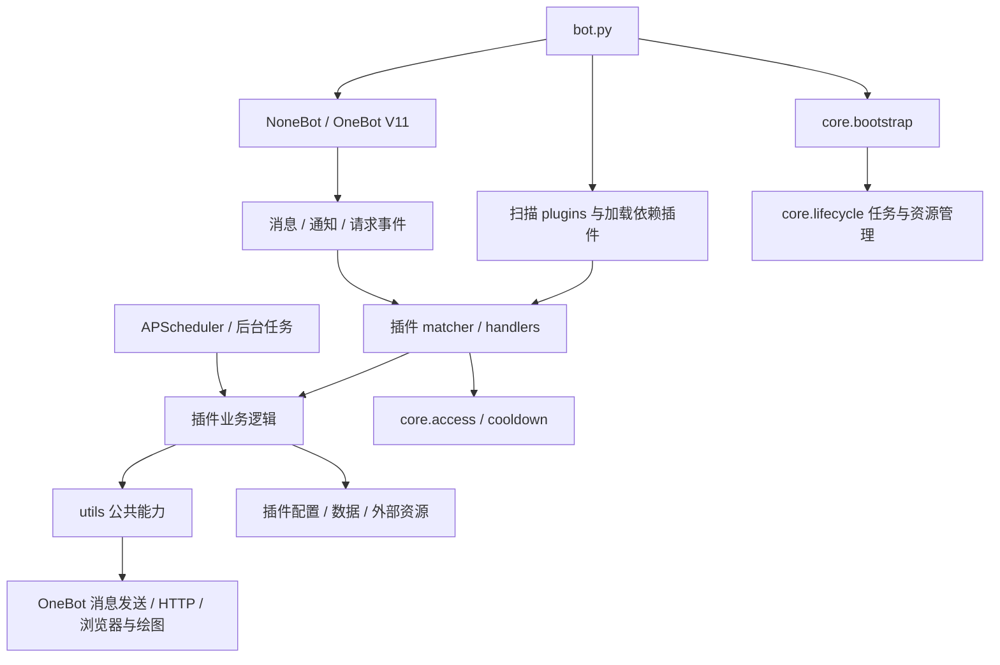

# HakuBot Python 版结构分析

本文记录 `/opt/HakuBot` 的现有结构，供 Go 重写时查阅，不代表 Go 版的目录设计。核对日期：2026-09-08。依据为主项目 `ARCHITECTURE.md`、实际文件树、`bot.py`、`pyproject.toml` 及源码中的导入、路径和注册关系。

本次为静态分析，未启动 Bot、执行业务命令或读取私密配置和数据库内容。下文的“加载”指源码中的加载路径，不保证部署时初始化成功或某个群已启用。资源文件合并列出，不展开用户数据、缓存、虚拟环境及 Git 内部文件。

## 1. 顶层结构

```text
/opt/HakuBot/
├── bot.py                      # NoneBot 启动与应用装配入口
├── pyproject.toml              # Python 依赖声明、OneBot 适配器、本地插件扫描配置
├── uv.lock                     # Python 依赖锁定
├── core/                       # 开关、冷却、配置读取及生命周期
├── utils/                      # 公共网络、LLM、媒体、绘图与渲染
├── plugins/                    # 37 个带 __init__.py 的本地插件目录
├── config/
│   ├── plugins/<插件名>/       # 部分插件的独立配置；并非每个插件都有该目录
│   └── nonebot_plugin_htmlrender/ # 现存旧目录，不能据此认定仍使用该插件
├── data/                       # 业务状态、数据库和资源，含历史命名及待核实目录
│   └── shared/
│       ├── fonts/              # 公共字体
│       ├── playwright/         # Chromium 等浏览器资源
│       └── rembg_models/       # 抠图模型
├── cache/                      # 可再生缓存；具体路径见后文
├── docs/
│   ├── bili_dyn_sub_design.md
│   ├── plugins_audit_2026-07-26.md
│   └── poke_reply_audit_and_hardening_plan.md
├── scripts/
│   └── migrate_bison_to_bili_dyn_sub.py # 旧订阅数据转换工具，不是启动入口
├── AGENTS.md                   # 项目约定
├── ARCHITECTURE.md             # 原有简版结构说明
├── README.md / LICENSE
├── .env.prod                   # 部署环境配置，不在本文展开内容
└── output.log                  # 运行日志
```

`.venv/`、`__pycache__/`、`.ruff_cache/`、`.git/`、`.codex/` 也存在，属于环境、工具或生成内容，不属于业务分层。

## 2. 启动与调用关系

`bot.py` 的实际顺序：

1. `nonebot.init()`，安装已知重复命令警告过滤器。
2. 获取 driver，注册 OneBot V11 适配器。
3. `core.bootstrap.configure(driver)`：为插件准备数据目录，读取开关、冷却和水印状态，注册公共资源清理回调。
4. 显式加载内置 `echo`，预加载 `nonebot_plugin_localstore`。
5. `nonebot.load_from_toml("pyproject.toml")`，扫描 `plugins/`。第三方插件列表虽为空，本地插件仍通过 `require(...)` 加载 APScheduler、Alconna 等依赖。
6. `core.bootstrap.finalize(driver)` 注册停机前暂停调度器、取消后台工作的回调，然后 `nonebot.run()`。

插件通常在 `__init__.py` 导入 handlers/matcher 来注册事件，也有把业务入口直接写在 `__init__.py` 的插件。部分模块导入时会读配置、建目录或读数据，不能把导入插件当作无副作用的检查。`plus_one` 的管理命令在启动回调里延迟导入。



这里画的是主要调用关系，不表示所有事件都经过统一中间件：开关和冷却由各插件显式调用，部分订阅类插件使用自己的权限和订阅设置。

## 3. core：应用核心

| 文件 | 实际职责 |
| --- | --- |
| `bootstrap.py` | 装配公共资源、初始化管理状态、定期清理渲染与出站媒体缓存、安排停机顺序 |
| `lifecycle.py` | `runtime` 管理后台任务、关闭函数、插件健康状态；提供插件启动/关闭回调包装 |
| `access.py` | 群级插件及子功能开关；处理默认启用、超管豁免和初始化不可用状态 |
| `access_state.py` | 持有并读写开关、CD 配置、CD 运行时间戳和水印状态 |
| `cooldown.py` | 按群、用户、功能计算与更新冷却；超管豁免 |
| `registry.py` | 可管理功能的静态目录，含 `插件:子功能`；不是插件加载器 |
| `settings.py` | 读取 JSON 并交给配置模型校验；管理写入时合并字段，保留未修改字段 |
| `index_cli.py` | 独立索引维护入口，动态加载 `pjsk_event_summary/services/index.py`，绕过 NoneBot 插件入口 |
| `__init__.py` | 包入口 |

通常是 `plugins → core / utils`、`core → utils`。静态导入扫描未发现 `utils` 反向导入 `core` 或具体插件，也未发现不同业务插件间的直接绝对导入。例外是 `core/index_cli.py` 动态加载具体插件服务，因此不能把 core 描述成完全不依赖业务。

`registry.py` 未收录的本地插件目录有：`add_friend`、`bili_dyn_sub`、`buaa_msm`、`hltv_sub`、`juya_daily_fetcher`、`pjskprofile_snowybot`、`plugin_manager`、`webconsole_bridge`。未收录不等于不加载，不能用管理菜单代替完整插件清单。

## 4. utils：公共能力结构树

```text
utils/
├── __init__.py
├── paths.py                    # project_root / PluginPaths / shared_cache
├── json_io.py                  # JSON 读取结果、原子写入
├── files.py                    # 临时文件、删除和输出目录
├── concurrency.py              # 公共线程池及关闭
├── logging.py                  # 日志上下文与异常摘要
├── text.py                     # 文本截断
├── images/
│   ├── __init__.py
│   └── formats.py              # 格式识别、校验、RGB 转换及编码
├── network/
│   ├── __init__.py
│   ├── http.py                 # HTTP 会话、代理、限量下载及临时下载
│   └── images.py               # 图片下载结果封装
├── llm/
│   ├── __init__.py
│   ├── client.py               # OpenAI 兼容聊天、生图、编辑及用量结果
│   └── json_output.py          # 结构化输出解析、可选修复与模型校验
├── onebot/
│   ├── __init__.py
│   ├── messages.py             # 消息段、@、回复图片和转发 ID 提取
│   ├── media.py                # 图片/音频消息段、出站文件缓存和容器路径映射
│   ├── forward.py              # 合并转发发送及结果状态
│   ├── avatar.py               # QQ 头像下载
│   ├── rules.py                # 精确命令规则
│   └── help.py                 # 帮助图发送，渲染失败时使用同源文本
└── rendering/
    ├── __init__.py
    ├── browser.py             # Playwright 浏览器复用、上下文并发及关闭
    ├── engine.py              # HTML、Jinja 模板、Markdown、文本转图片
    ├── cache.py               # 多页渲染缓存及过期清理
    ├── fonts.py               # 公共/系统字体定位、加载及 CSS
    ├── models.py              # 帮助文档和渲染结果模型
    ├── help.py                # 帮助文本和分页图片生成
    ├── themes.py              # 日间/夜间主题选择
    ├── draw/
    │   ├── __init__.py
    │   ├── painter.py         # 字体、颜色、渐变及底层绘制
    │   ├── plot.py            # 画布、布局和图文组件
    │   ├── cards.py           # 排行榜卡片
    │   └── img_utils.py       # GIF/APNG、裁切、拼接等图像工具
    └── templates/             # help/markdown/text 模板、CSS、KaTeX 静态资源
```

公共层同时存在浏览器截图和 Pillow 绘图两条路径，不是所有图片都由 HTML 渲染。`utils/onebot`、日志等模块仍依赖 NoneBot；“公共工具”不等于“框架无关代码”。

帮助使用 `HelpDocument → rendering.help → onebot.help`，上海时间 06:00–18:00 为日间主题，其余为夜间主题；全局菜单内容仍由 `plugins/help_plugin/content.py` 手写。HLTV、群日报、早报的业务模板保留在各自插件中。

## 5. plugins：完整插件清单与内部结构

以下 37 个目录均具有 `__init__.py`，处于配置指定的扫描目录内。`pjskprofile_snowybot` 只保留空功能入口，其 `bind`、`profile` 导入已注释；其他插件是否成功启动还取决于配置、资源及运行环境。

| 插件 | 职责与主要模块 |
| --- | --- |
| `add_friend` | 好友请求处理及管理；request_handler、command_handler、data_manager |
| `ai_assistant` | AI 对话、生图与搜索；matcher → chat_service/chat_harness/imagen_service，search 子包组织查询、证据和搜索流程 |
| `alive_stat` | 存活与运行状态统计；collector、runtime、drawer |
| `analysis_bilibili` | B 站链接解析；analysis_bilibili、sign、ExpiringCache |
| `atri_reply` | ATRI 关键词回复；handlers |
| `bili_dyn_sub` | B 站动态订阅；API、凭据、解析、渲染、调度和投递状态，替代 nonebot-bison |
| `buaa_msm` | PJSK MySekai 数据上传、绑定、解密解析与 MSR 渲染；区分 handlers、services、domain、infra、parsers、renderers |
| `daily_message` | 定时消息及管理；handlers、command_handler、config_manager |
| `deer_pipe` | 签到、补签、日历；matchers、SQLModel 数据库、image、assets |
| `draw_lots` | 抽签；handlers、message、render |
| `group_daily_analysis` | 本地采集群消息，统计及 LLM 分析后生成日报；database、data_source、analysis、render、visualization |
| `group_statistics` | 群消息计数与统计图；data_manager、handlers、scheduler、render，与群日报是独立数据流 |
| `groupmate_waifu` | 娶群友、分手、保护等互动；handlers、service、data_manager、storage、render |
| `help_plugin` | 全局帮助菜单；content、config、入口中的发送逻辑 |
| `hltv_sub` | CS2 赛事查询与订阅；handlers、data_source、HTTP、parsers、scheduler_internal、模板渲染 |
| `identify` | 鉴定互动及每日记录；handlers、data_manager，数据留在插件内 |
| `image_processor` | GIF 速度/倒放、镜像、旋转、对称、抠图、视频转 GIF；handlers、各处理算法、runtime、模型预下载 |
| `jrrp` | 今日人品；handlers |
| `juya_daily_fetcher` | 橘鸦 AI 早报 RSS 获取、摘要、长图与投递；parser、summary、render、deliver、scheduler、store |
| `lunabot_imgexp` | 搜图及 X/Twitter 图片获取；core、twitter |
| `pixiv_id_fetcher` | 按 Pixiv ID 获取作品；matcher、client、formatter、models |
| `pjsk_event_summary` | PJSK 剧情查询和本地 MoeSekai 索引维护；api、render、scheduler、services/index |
| `pjsk_guess_card` | 猜卡面；入口包含游戏流程，card_data、nickname、image_utils 提供支持 |
| `pjsk_guess_song` | 猜歌、听歌与排行榜；handlers、game_session、runtime、音频/图片/缓存/数据库/game 服务，tools 提供离线资源生成 |
| `pjskprofile_snowybot` | 旧绑定与个人资料功能源码；入口已停用业务导入，不能计为正常提供命令的插件 |
| `plugin_manager` | 开关、CD 管理命令与展示；实际状态和策略在 core |
| `plus_one` | 消息复读及管理命令；handler、command_handler、config |
| `poke_reply` | 戳一戳回复、投稿、删除申请和统计；handlers、models、services、文件监听 |
| `recall` | 自我撤回；self_recall |
| `send_and_reply` | 用户给 Bot 主发消息及回复；send、reply、content |
| `setu_plugin` | 图片请求与发送；handlers、client |
| `sk_predict` | PJSK 活动预测图；data_source、service、scheduler、render |
| `sticker_saver` | 保存 QQ 动画表情；handlers |
| `stickers` | 随机表情、投稿、管理、去重与统计；send、contribution、manage、check、cache_db、overview、statistics |
| `two_choices` | 二择互动；handlers |
| `webconsole_bridge` | 无用户命令；采集事件响应、诊断日志和在线状态，向 WebConsole 共享存储写入 |
| `welcome` | 新群员欢迎；handlers |

### 插件文件树

同一目录的 Python 文件合并到一行；子目录继续展开。此树来自实际文件，不要求 Go 版照搬这些分层。

```text
plugins/
├── add_friend/
│   └── __init__.py, command_handler.py, config.py, data_manager.py, request_handler.py, utils.py
├── ai_assistant/
│   ├── __init__.py, config.py, matcher.py, utils.py
│   └── services/
│       ├── __init__.py, chat_harness.py, chat_service.py, imagen_service.py
│       └── search/
│           └── __init__.py, client.py, evidence.py, normalization.py, queries.py, visual.py, workflow.py
├── alive_stat/
│   └── __init__.py, collector.py, config.py, drawer.py, runtime.py
├── analysis_bilibili/
│   └── ExpiringCache.py, __init__.py, analysis_bilibili.py, sign.py
├── atri_reply/
│   └── __init__.py, handlers.py
├── bili_dyn_sub/
│   ├── __init__.py, api.py, backoff.py, config.py, credential.py, handlers.py, parser.py, render.py, scheduler.py, store.py
│   └── services/
│       └── __init__.py, delivery.py, login.py, polling.py, selection.py, state.py
├── buaa_msm/
│   ├── __init__.py, analysis.py, config.py, data_rename.py, exceptions.py
│   ├── domain/
│   │   └── __init__.py, constants.py, models.py
│   ├── handlers/
│   │   └── __init__.py, admin.py, bind.py, help.py, msr.py, upload.py
│   ├── infra/
│   │   └── __init__.py, cache.py, decryptor.py, storage.py, visit_history.py
│   ├── parsers/
│   │   └── __init__.py, map_parser.py
│   ├── renderers/
│   │   └── __init__.py, msr.py
│   ├── resources/
│   │   ├── __init__.py, catalog.py
│   │   └── icon/
│   │       └── clean_up.py
│   └── services/
│       └── __init__.py, maintenance_service.py, masterdata_lite.py, msr_service.py, processing_guard.py, rip_asset_lite.py, user_data_service.py
├── daily_message/
│   └── __init__.py, command_handler.py, config_manager.py, handlers.py
├── deer_pipe/
│   ├── __init__.py, config.py, constants.py, database.py, image.py, matchers.py, requirements.py
│   └── assets（静态资源）
├── draw_lots/
│   └── __init__.py, handlers.py, message.py, render.py
├── group_daily_analysis/
│   ├── __init__.py, config.py, data_source.py, database.py, handlers.py, models.py
│   ├── analysis/
│   │   ├── context.py, fallbacks.py, main.py, prompts.py, schemas.py, statistics.py, titles.py, topics.py
│   │   └── analyzers/
│   │       └── __init__.py, common.py
│   ├── render/
│   │   ├── renderer.py
│   │   └── templates（静态资源）
│   ├── utils/
│   │   └── llm.py
│   └── visualization/
│       └── charts.py
├── group_statistics/
│   └── __init__.py, config.py, data_manager.py, handlers.py, render.py, scheduler.py, utils.py
├── groupmate_waifu/
│   ├── __init__.py, config.py, constants.py, data_manager.py, render.py, rules.py, service.py, storage.py, utils.py
│   └── handlers/
│       └── __init__.py, divorce.py, lists.py, marry.py, protect.py, yinpa.py
├── help_plugin/
│   └── __init__.py, config.py, content.py
├── hltv_sub/
│   ├── __init__.py, config.py, data_manager.py, data_source.py, help_content.py, http_client.py, models.py, permissions.py, render.py, scheduler.py
│   ├── handlers/
│   │   └── __init__.py, admin.py, debug.py, event.py, help.py, matches.py, results.py, stats.py
│   ├── parsers/
│   │   └── __init__.py, common.py, events.py, matches.py, results.py, stats.py
│   ├── scheduler_internal/
│   │   └── __init__.py, constants.py, map_result_readiness.py, poll_models.py, result_readiness.py, state.py, types.py, wakeup.py
│   └── templates（静态资源）
├── identify/
│   └── __init__.py, config.py, data_manager.py, handlers.py
├── image_processor/
│   ├── __init__.py, gif_reverse.py, gif_speed.py, help.py, image_cutout.py, image_mirror.py, image_rotate.py, image_symmetry.py, rembg_prefetch.py, runtime.py, utils.py, video_to_gif.py
│   └── handlers/
│       └── __init__.py, cutout.py, gif.py, help.py, mirror.py, registration.py, rotate.py, symmetry.py, video.py
├── jrrp/
│   └── __init__.py, handlers.py
├── juya_daily_fetcher/
│   ├── __init__.py, config.py, deliver.py, parser.py, render.py, scheduler.py, store.py, summary.py
│   └── templates（静态资源）
├── lunabot_imgexp/
│   └── __init__.py, config.py, core.py, twitter.py
├── pixiv_id_fetcher/
│   └── __init__.py, client.py, config.py, formatter.py, matcher.py, models.py
├── pjsk_event_summary/
│   ├── __init__.py, api.py, models.py, render.py, scheduler.py
│   └── services/
│       └── __init__.py, index.py
├── pjsk_guess_card/
│   └── __init__.py, card_data.py, config.py, image_utils.py, nickname.py
├── pjsk_guess_song/
│   ├── __init__.py, config.py, game_data.py, game_session.py, help_content.py, runtime.py, utils.py
│   ├── handlers/
│   │   └── __init__.py, game.py, leaderboard.py, listen.py, other.py
│   ├── services/
│   │   └── __init__.py, audio_processor.py, cache_service.py, db_service.py, game_service.py, image_service.py
│   └── tools/
│       └── generate_guess_song.py, generate_piano.py, generate_stems.py, get_aliases.py, get_data.py
├── pjskprofile_snowybot/
│   └── __init__.py, bind.py, config.py, data_manager.py, profile.py, render.py
├── plugin_manager/
│   ├── __init__.py, render.py
│   └── handlers/
│       └── __init__.py, cd_manager.py, enable.py
├── plus_one/
│   └── __init__.py, command_handler.py, config.py, handler.py
├── poke_reply/
│   ├── __init__.py, config.py, file_monitor.py
│   ├── handlers/
│   │   └── contribute.py, management.py, poke.py, stats.py, view.py
│   ├── models/
│   │   └── cache.py, data.py, request.py
│   ├── services/
│   │   └── contribute.py, health.py, image.py, text.py
│   └── utils/
│       └── __init__.py, common.py
├── recall/
│   └── __init__.py, self_recall.py
├── send_and_reply/
│   └── __init__.py, content.py, reply.py, send.py
├── setu_plugin/
│   └── __init__.py, client.py, handlers.py
├── sk_predict/
│   └── __init__.py, config.py, data_source.py, render.py, scheduler.py, service.py
├── sticker_saver/
│   └── __init__.py, handlers.py
├── stickers/
│   └── __init__.py, cache_db.py, check.py, config.py, contribution.py, handlers.py, help.py, help_content.py, manage.py, overview.py, send.py, statistics.py
├── two_choices/
│   └── __init__.py, handlers.py
├── webconsole_bridge/
│   └── __init__.py, capture.py, config.py, database.py, diagnostics.py, models.py, persistence.py, status.py
└── welcome/
    └── __init__.py, handlers.py
```

图中未逐个展开的插件静态资源还包括：`alive_stat/resources/font.ttf`、`identify/resources/BB_*.png`、`buaa_msm/resources/` 下的字体、图标和场景图，以及 `deer_pipe/assets/` 下的字体和日历素材。`group_daily_analysis/render/templates/` 有 format、retro_futurism、scrapbook、simple 四组主题。并非全部字体和图片都已集中到 `data/shared/`。

## 6. 配置、数据与缓存位置

### 路径规则及例外

`utils/paths.py` 的 `project_root()` 默认取源码根目录，可用 `HAKUBOT_ROOT` 覆盖。`PluginPaths` 本身不建目录；启动装配和业务代码负责创建。

| 访问方式 / 插件 | 源码约定的位置 |
| --- | --- |
| `PluginPaths(id).config` | `config/plugins/<id>/` |
| 通常的 `.data` | `data/<id>/` |
| `groupmate_waifu.data` | `data/waifu/` |
| `alive_stat.data` | `data/alive_stats/` |
| `sk_predict.data` | `data/sekai_cache/`；该插件还可通过自身配置决定数据位置 |
| `identify.data` | `plugins/identify/data/`，不在根目录 data 中 |
| `.cache` | `cache/<id>/` |
| `.resources` | `plugins/<id>/resources/`，不涵盖所有自定义 assets 路径 |
| `shared_cache("rendering")` | `cache/shared/rendering/`，由使用时生成；本次磁盘扫描尚无此目录 |

并非所有配置都经过 `core.settings.load_config`：有插件自己读取 JSON，有插件使用 NoneBot 配置或模块常量。根目录 `.env.prod` 与插件私有配置应分开理解，不能假设每个 `config.py` 都对应一个 `config/plugins/<id>/config.json`。

### 关键持久化归属

下表是根据路径常量和读写代码确认的关键存储，并非数据库字段或所有文件的迁移清单。

| 所属模块 | 位置 / 形式 | 内容 |
| --- | --- | --- |
| core / plugin_manager | `data/plugin_manager/{plugin_status,cd_config,cd_runtime,watermark_config}.json` | 群开关、冷却设置与运行时间戳、水印设置 |
| deer_pipe | `data/deer_pipe/userdata-v3.db` | SQLite，用户与签到记录，SQLModel/SQLAlchemy 访问 |
| group_daily_analysis | `data/group_daily_analysis/messages.db` | SQLite，本地群消息记录；日报从这里取消息 |
| pjsk_guess_song | `data/pjsk_guess_song/guess_song_data.db` | SQLite，猜歌业务记录 |
| stickers | `data/stickers/list.json`、素材子目录、`hash_cache.db` | 表情配置与文件、SQLite 哈希缓存；业务素材与可再生缓存混放 |
| bili_dyn_sub | `data/bili_dyn_sub/state.json`、`credential.json` | 订阅、去重游标与凭据状态 |
| groupmate_waifu | `data/waifu/` 下的 JSON | 群友互动状态 |
| poke_reply | `data/poke_reply/` | text_files、image_files、config_files，以及消息、文本图片、删除申请和图片哈希缓存 JSON |
| identify | `plugins/identify/data/daily_records.json` | 每日鉴定记录 |
| alive_stat / group_statistics | 各自数据目录的 `stats.json` | 两份独立统计状态 |
| juya_daily_fetcher | `data/juya_daily_fetcher/state.json`、`articles/` | 投递去重状态及文章资源 |
| webconsole_bridge | 配置指定的绝对 `database_path`、`spool_path` | WebConsole 共享 SQLite 与待写入文件，不保证位于本仓库内 |

磁盘上另有 `data/data.db`、`data/ai_assistant_music/`。在本次扫描的 Python 源码与依赖声明中未找到明确同名使用入口，先标为归属待核实，不能仅凭存在就认定为活跃功能，也不能直接删除。

实际 `cache/` 下有 `outbound_media/`、`pixiv_id_fetcher/`、`setu_plugin/` 和 `nonebot_plugin_htmlrender/`。后者与同名配置目录存在，但在当前业务 Python 源码中未检出该模块引用；磁盘遗留目录不等于当前运行依赖。部分图片/视频处理还使用系统临时目录，部分缓存位于 data 内，因此仅查看根目录 cache 不能覆盖全部缓存。

## 7. 外部连接与资源边界

| 边界 | 当前连接方式与使用方 |
| --- | --- |
| QQ / OneBot V11 | NoneBot 适配器收发事件；公共媒体层通过 `NAPCAT_SHARED_HOST_ROOT`、`NAPCAT_SHARED_CONTAINER_ROOT` 映射宿主机与 NapCat 容器文件路径 |
| 定时与后台工作 | APScheduler 用于多种订阅、统计和周期任务；`core.lifecycle.runtime` 管理显式提交的异步任务；poke_reply 还有文件监听器 |
| 浏览器渲染 | 公共 Playwright Chromium 池；默认资源路径 `data/shared/playwright/`，可由环境变量覆盖 |
| 字体与图片处理 | 公共字体、系统字体、插件素材并存；图片处理使用 Pillow/OpenCV，视频转 GIF 使用 FFmpeg 并有 OpenCV 备选路径 |
| 抠图 | image_processor 懒加载 rembg/ONNX 推理，模型默认在 `data/shared/rembg_models/`，`U2NET_HOME` 可覆盖；依赖声明没有直接列出 rembg/onnxruntime，不能只看 pyproject 判定能力齐备 |
| PJSK masterdata | buaa_msm、pjsk_guess_song、pjsk_guess_card 使用仓库旁的 `haruki-sekai-master/master/`；其中部分路径可配置，并非全部经过 `HAKUBOT_ROOT` |
| PJSK 剧情资源 | `pjsk_event_summary/services/index.py` 默认读取 `/opt/moesekai-hub`，写 `/opt/moesekai-hub-index`；依赖外部同步好的剧情文件，CLI 支持覆盖路径 |
| WebConsole | bridge 对共享库 schema 和目录做探测，采集真实响应、诊断和在线状态；它是采集桥，不是 Web 前端或独立 WebConsole 服务 |
| HTTP / LLM | B 站、HLTV、Pixiv、搜图、RSS、PJSK API 等由各插件调用；ai_assistant、group_daily_analysis、juya_daily_fetcher 共用 LLM 客户端能力，各持自己的业务配置 |

这是结构层面的依赖边界，不是下一阶段的 Go 库选型。现有业务 HTTP 客户端也未全部统一到 `utils/network`，例如 HLTV 保有自己的 `http_client.py`，不能按公共工具目录推断全部协议细节。

群消息至少有三条不同用途的数据流：`group_statistics` 做计数，`group_daily_analysis` 采集消息供日报分析，`webconsole_bridge` 采集响应与诊断供控制台使用；它们没有统一成一个消息数据库。

## 8. 对原结构文档的核对结论

原文的 `plugins / core / utils` 顶层职责、公共资源路径、帮助图主题和业务模板归属基本正确，但不足以作为完整重写清单。本次补充或限定了以下内容：

- 补全 37 个插件及内部源码结构，明确旧 snowybot 资料功能入口已停用。
- 区分插件扫描、管理功能注册表和实际启用状态，补上显式加载的 echo、localstore 及 `require` 依赖。
- 补上 LLM 公共层、绘图层、OneBot 媒体路径映射，以及 core 的索引 CLI 例外。
- 将“业务数据通过 PluginPaths”限定为主要路径约定，列出 identify、历史目录别名、外部索引及 WebConsole 共享存储等例外。
- 区分源码定义的公共渲染缓存路径与本次磁盘上实际存在的目录；不将旧 htmlrender 目录当成仍在使用的公共渲染实现。
- 补上仓库外 masterdata、剧情索引、FFmpeg、模型和浏览器资源，避免只迁移源码后遗漏运行所需资源。

本文不把旧注释、历史审计文档或插件元信息直接视为现状证明；模块职责以实际入口和实现为准。数据库完整 schema、配置字段、命令权限细节及外部服务可用性留待对应功能分析，不在本次结构梳理中声称已核实。
